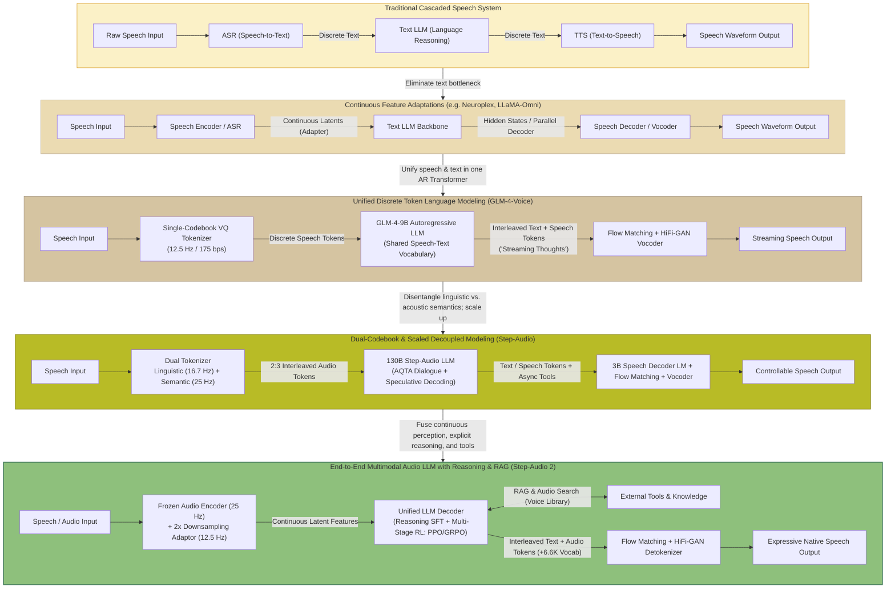

# Unified Audio LLM Architecture — Research Roadmap

Welcome to the **Unified Audio LLM Architecture** research index. This repository documents the architectural evolution of speech-language foundation models, tracking how speech and audio modalities have moved from loose, cascaded multi-system pipelines toward tightly integrated, native audio-language models.

---

## 1. Purpose

This roadmap serves as the top-level architectural guide and index for the research documents and papers assembled in this repository. Specifically, this collection explores:

- **Evolution toward unified audio/speech LLMs:** How modern architectures transition from disjointed cascaded systems (ASR &rarr; LLM &rarr; TTS) toward unified autoregressive foundation models capable of direct speech perception, reasoning, and speech generation.
- **Incorporation of speech/audio into the LLM:** The differing paradigms used to bridge continuous acoustic waveforms and discrete language models—ranging from single-codebook discrete tokens, dual-codebook linguistic/semantic tokens, to continuous frozen encoder latents.
- **Architectural trade-offs:** How design choices affect real-time interaction latency, model capacity, acoustic expressiveness, semantic coherence, tool use, and multi-turn conversational context.
- **Progression from cascade to native modeling:** How speech moves from being an external conversion layer toward becoming a first-class citizen inside the autoregressive transformer.

> [!NOTE]
> This roadmap is an overarching conceptual index. The exhaustive technical analyses, mathematical formulations, and layer-by-layer configurations reside in the individual architecture documents linked throughout this file.

---

## 2. Overall Architecture Evolution

The diagram below illustrates the conceptual progression of speech-to-speech interaction systems represented across the papers in this workspace.



> [!IMPORTANT]
> **Evolutionary Interpretation vs. Strict Performance Ranking:**
> This progression does **not** denote a monotonic benchmark ranking where a later model strictly supersedes an earlier one across all tasks. Instead, it reflects an **architectural evolution** in how research teams tackle the fundamental tension between:
> 1. Preserving paralinguistic fidelity (emotion, timbre, prosody),
> 2. Maintaining deep semantic reasoning capabilities,
> 3. Keeping real-time streaming inference latency acceptable for interactive conversation.

---

## 3. Document Map

The table below maps the primary models analyzed in this repository to their respective technical notes, source papers, and core architectural innovations:

| Model | Detailed Architecture Notes | Original Paper / Source | Main Architectural Idea |
|---|---|---|---|
| **GLM-4-Voice** | [GLM-4-Voice Architecture](glm_4_voice_architecture.md) | [GLM-4-Voice Paper](papers/glm-4voice.pdf) | Single-codebook 12.5 Hz / 175 bps speech tokenizer sharing vocabulary with GLM-4-9B; 1T-token pretraining; "Streaming Thoughts" interleaved generation. |
| **Step-Audio** | [Step-Audio Architecture](step_audio_architecture.md) | [Step-Audio Paper](papers/stepaudio%20.pdf) | Dual-codebook speech tokenizer (16.7 Hz linguistic + 25 Hz semantic interleaved at 2:3 ratio) feeding a 130B multimodal LLM; AQTA + 3B TTS decoder; asynchronous tool calling. |
| **Step-Audio 2** | [Step-Audio 2 Architecture](step_audio_2_architecture.md) | [Step-Audio 2 Paper](papers/step-audio2.pdf) | End-to-end LALM using a frozen continuous audio encoder (downsampled to 12.5 Hz), reasoning-centric SFT + multi-stage RL (PPO/GRPO), interleaved text/audio token generation, and Audio Search. |

### Supplementary Workspace Documents

In addition to the primary triad above, the repository contains research materials on closely related speech-to-speech architectures:

| Document / Asset | Source File | Key Architectural Relevance |
|---|---|---|
| **Deepgram Neuroplex Notes** | [neuroplex.md](neuroplex.md) | Explains continuous speech-to-speech pipelines passing hidden representations between specialized modules without text bottlenecks. |
| **Neuroplex Technical Paper** | [deepgram-neuroplex-v4.pdf](papers/deepgram-neuroplex-v4.pdf) | Primary technical report on continuous speech-to-speech architectures vs. conventional cascades. |
| **LLaMA-Omni Technical Paper** | [llama-omini.pdf](papers/llama-omini.pdf) | Demonstrates low-latency speech interaction by adapting a frozen Whisper encoder to LLaMA-3.1-8B with parallel speech decoding. |
| **General Synthesis Notes** | [main.md](main.md) | Research synthesis covering continuous STS, Hertz-dev latent AR codecs, and agentic speech reasoning. |

---

## 4. Architecture Relationship

Each model in the core set offers a distinct perspective on how to integrate speech into a language model. Below is a high-level wrapper overview of their mechanisms and how they relate:

### GLM-4-Voice
- **Speech Representation:** Converts audio to discrete speech tokens using a single-codebook vector-quantized tokenizer derived from Whisper-large-v3, operating at an ultra-low frame rate of **12.5 Hz** and a bitrate of **175 bps**.
- **LLM Interaction:** The vocabulary of the **GLM-4-9B** text LLM is directly expanded to incorporate the discrete speech tokens. The model treats speech tokens as regular tokens in autoregressive next-token prediction, sharing the same representation for speech input and speech output.
- **Speech Generation:** A **CosyVoice-style speech decoder** uses a speech token encoder, conditional flow matching to synthesize Mel spectrograms, and a HiFi-GAN neural vocoder for waveform generation.
- **Relationship & Distinction:** Unlike traditional ASR &rarr; LLM &rarr; TTS cascades, speech generation is embedded directly into the LLM's autoregressive prediction. To prevent latency overhead from generating full text answers first, GLM-4-Voice introduces **"Streaming Thoughts"**, alternating 13 text tokens with 26 speech tokens (1:2 ratio) during generation.
- **Detailed Reference:** See [GLM-4-Voice Architecture](glm_4_voice_architecture.md) and the [GLM-4-Voice Paper](papers/glm-4voice.pdf).

---

### Step-Audio
- **Speech Tokenizer:** Disentangles speech into a **dual-codebook** representation:
  1. *Linguistic tokenizer:* Derived from the Paraformer encoder (16.7 Hz, 1024-entry codebook) for phonemic/content information.
  2. *Semantic tokenizer:* Derived from CosyVoice (25 Hz, 4096-entry codebook) for semantic and acoustic context.
  The two streams are temporally interleaved at an aligned **2:3 ratio** (`L L S S S`).
- **LLM:** Scaled to **130B parameters** (continually pretrained from Step-1), allowing deep contextual audio-text understanding. Conversational history compresses past turns into text (1 text token &approx; 14 audio tokens) to manage context length.
- **Speech Decoder:** An independent **3B-parameter decoder language model** coupled with Flow Matching and a neural vocoder.
- **Relationship & Distinction:** Where GLM-4-Voice forced speech into a single 175 bps codebook, Step-Audio explicitly proved that single codebooks suffer from a trade-off between acoustic fidelity and language modeling perplexity. Furthermore, for production stability, Step-Audio decouples real-time voice chat into an **AQTA (Audio Question &rarr; Text Answer) + TTS** paradigm, allowing asynchronous tool execution and speculative decoding when user pauses are detected.
- **Detailed Reference:** See [Step-Audio Architecture](step_audio_architecture.md) and the [Step-Audio Paper](papers/stepaudio%20.pdf).

---

### Step-Audio 2
- **Audio Encoder & Adaptor:** Takes raw speech through a **frozen pretrained audio encoder** running at 25 Hz. An **Audio Adaptor** applies 2&times; downsampling to output latent acoustic features at **12.5 Hz** directly into the LLM decoder space, eliminating the need to tokenize input audio into discrete codebooks.
- **LLM:** An end-to-end Large Audio Language Model (LALM) continually pretrained on **1.356T tokens** (text and audio). Vocabulary is expanded with **6.6K discrete audio tokens** (from CosyVoice 2).
- **Interleaved Generation:** The LLM autoregressively predicts an interleaved stream of text tokens and audio tokens, which are separated downstream.
- **Audio Detokenizer:** Discrete audio tokens pass to a Flow-Matching module (with CNN layers interleaved after self-attention) and a HiFi-GAN vocoder.
- **Relationship & Distinction:** Step-Audio 2 bridges the gap between continuous feature perception (input) and native discrete token generation (output). Unlike GLM-4-Voice (which lacked explicit CoT reasoning and RL) and Step-Audio (which used RLHF primarily for voice dialogue alignment), Step-Audio 2 incorporates **reasoning-centric SFT**, multi-stage **PPO (with length constraints) & GRPO**, and an external **Audio Search tool** to retrieve acoustic reference prompts from a voice library.
- **Detailed Reference:** See [Step-Audio 2 Architecture](step_audio_2_architecture.md) and the [Step-Audio 2 Paper](papers/step-audio2.pdf).

---

## 5. Side-by-Side Architecture Comparison

The following table presents a structured comparison across all three models based strictly on the source documents:

| Architectural Dimension | GLM-4-Voice | Step-Audio | Step-Audio 2 |
|---|---|---|---|
| **Primary Input** | Speech waveform or text | Speech waveform or text | Raw audio / speech waveform |
| **Input Audio Representation** | Discrete speech tokens (single codebook) | Discrete dual-codebook tokens (linguistic + semantic) | Continuous latent acoustic features |
| **Speech / Audio Encoder or Tokenizer** | Whisper-large-v3 derived tokenizer (pooling + VQ, 12.5 Hz, 175 bps) | Dual: Paraformer encoder (16.7 Hz, 1024 codebook) + CosyVoice tokenizer (25 Hz, 4096 codebook) | Frozen pretrained audio encoder (25 Hz; trained on ASR, speaker age/gender, audio events) |
| **Audio &rarr; LLM Adaptor** | None (discrete tokens directly in expanded LLM vocabulary) | Token interleaver (2:3 temporal alignment into vocabulary) | Audio Adaptor with 2&times; downsampling (25 Hz &rarr; 12.5 Hz) |
| **Core LLM Backbone** | GLM-4-9B-Base (expanded vocabulary) | Step-1 130B (continually pretrained with audio tokens) | Textual LLM decoder continually pretrained on 1.356T tokens |
| **Audio / Speech Generation Mechanism** | Flow-Matching speech decoder + HiFi-GAN vocoder | 3B speech decoder LM + Flow Matching + neural vocoder | Flow Matching (CNN blocks in transformer) + HiFi-GAN vocoder |
| **Primary Output** | Interleaved text tokens + speech tokens &rarr; streaming waveform | Text answer + audio tokens &rarr; AQTA + TTS waveform | Interleaved text tokens + audio tokens (+6.6K vocab) &rarr; speech |
| **Streaming Capability** | Fully streaming (causal/block-causal attention, chunked decoding $b=0.8$s) | Fully streaming (streaming tokenizer, speculative decoding, streaming TTS) | Supported (interleaved streaming generation + streaming detokenizer) |
| **Text / Audio Token Interaction** | "Streaming Thoughts": alternates 13 text tokens with 26 speech tokens (1:2 ratio) | Dual tokens interleaved at 2:3 ($L L S S S$); historical turns compressed to text (1:14 ratio) | Continuous input features; autoregressively generates interleaved text and audio tokens |
| **Reasoning / Chain-of-Thought (CoT)** | Not a core component (Streaming Thoughts is for latency, not explicit CoT) | Not specified in the source as CoT reasoning | Explicitly supported via reasoning-centric SFT (acoustic & paralinguistic reasoning traces) |
| **Reinforcement Learning (RL / RLHF)** | Not specified in the source / not used as a core method | Explicitly supported: RLHF with PPO for voice dialogue preference alignment | Explicitly supported: Multi-stage PPO (Stage 1 binary length control, Stage 2 reward model) + GRPO |
| **Tool / RAG Capabilities** | Not specified in the source | Explicitly supported: Asynchronous tool calling & knowledge retrieval | Explicitly supported: RAG, Web Search, Date/Time, Weather, and Audio Search |
| **Unique / Main Architectural Contribution** | Shared 12.5 Hz single-codebook tokenization; 1T speech-text pretraining; Streaming Thoughts | Dual-codebook disentanglement (16.7 Hz / 25 Hz); 130B audio LLM; speculative response generation | Continuous encoder + discrete generator; reasoning CoT with PPO length control; Audio Search library |
| **Degree of Audio-Language Integration** | High discrete integration (speech tokens as native vocabulary) | Hybrid integration (discrete token comprehension; decoupled AQTA + TTS for control) | High end-to-end multimodal integration (continuous input latents &rarr; LLM &rarr; discrete output tokens) |

---

## 6. Unified Architecture View

Although these models use distinct tokenizers, parameter scales, and training recipes, they follow a common generalized blueprint for audio-language modeling.

```mermaid
flowchart TD
    subgraph Common["Generalized Unified Audio LLM Pattern"]
        IN["Audio Input (Waveform)"] --> REP["Audio Representation Layer"]
        REP --> INT["Audio ↔ LLM Interface"]
        INT --> LLM["Language & Reasoning Backbone"]
        LLM --> GEN["Audio Generation Layer"]
        GEN --> OUT["Speech Waveform Output"]
    end

    subgraph Imp["Model-Specific Implementations"]
        direction TB

        subgraph ImpG["GLM-4-Voice Implementation"]
            g1["12.5 Hz Single-Codebook Tokenizer (Whisper-derived)"]
            g2["Direct Token Embedding Lookup (No Adaptor)"]
            g3["GLM-4-9B (Streaming Thoughts: 13 text : 26 speech tokens)"]
            g4["Speech Token Encoder + Conditional Flow Matching + HiFi-GAN"]
        end

        subgraph ImpS1["Step-Audio Implementation"]
            s1["Dual-Codebook: Paraformer (16.7 Hz) + CosyVoice (25 Hz)"]
            s2["2:3 Temporal Interleaving (L L S S S) into 130B Vocab"]
            s3["130B Step-1 LLM (AQTA Dialogue + Speculative Decoding)"]
            s4["3B Decoder LM + Flow Matching + Neural Vocoder"]
        end

        subgraph ImpS2["Step-Audio 2 Implementation"]
            t1["Frozen Continuous Audio Encoder (25 Hz)"]
            t2["Audio Adaptor (2x Downsampling to 12.5 Hz)"]
            t3["Step-Audio 2 LLM Decoder (Reasoning SFT + PPO/GRPO + Tools)"]
            t4["Flow Matching Detokenizer (+6.6K tokens) + HiFi-GAN"]
        end
    end

    REP -.-> g1
    REP -.-> s1
    REP -.-> t1

    INT -.-> g2
    INT -.-> s2
    INT -.-> t2

    LLM -.-> g3
    LLM -.-> s3
    LLM -.-> t3

    GEN -.-> g4
    GEN -.-> s4
    GEN -.-> t4

    style Common fill:#fbf1c7,stroke:#d79921,stroke-width:1px
    style ImpG fill:#ebdbb2,stroke:#bdae93,stroke-width:1px
    style ImpS1 fill:#d5c4a1,stroke:#a89984,stroke-width:1px
    style ImpS2 fill:#b8bb26,stroke:#79740e,stroke-width:1px
```



### Architectural Divergence Points

1. **Input Interface (Discrete vs. Continuous):**
   - *GLM-4-Voice & Step-Audio:* Discretize input speech into categorical tokens prior to the LLM.
   - *Step-Audio 2:* Feeds continuous latent representations into the LLM through a downsampling projection layer, preserving fine-grained acoustic nuances that discrete tokenizers often discard.
2. **Discrete Representation (Single vs. Dual Codebook):**
   - *GLM-4-Voice:* Forces all speech dynamics into a single 12.5 Hz codebook (175 bps) to minimize sequence length.
   - *Step-Audio:* Employs two specialized codebooks (linguistic vs. semantic) interleaved temporally to balance language perplexity with acoustic fidelity.
3. **Generation Strategy (Tightly Interleaved vs. Decoupled):**
   - *GLM-4-Voice:* Micro-interleaves text and speech tokens at a fixed 1:2 ratio to stream speech while maintaining text guidance.
   - *Step-Audio:* Generates text answers and speech tokens via an AQTA structure feeding a standalone 3B speech decoder for maximum controllability.
   - *Step-Audio 2:* Employs end-to-end interleaved text/audio generation directly conditioned on reasoning traces and external tool calls.

---

## 7. Evolution of Audio Representation

A central challenge in unified audio modeling is designing an audio representation that the transformer can process alongside natural language:

### 1. The Discretization Dilemma (Speech Codecs & Quantizers)
Traditional audio codecs (such as SoundStream, EnCodec) utilize Residual Vector Quantization (RVQ) with 8 to 32 parallel codebook levels, resulting in high token rates (e.g., 50–150 frames/sec &times; 8 codebooks = 400–1200 tokens/sec). Feeding this into an autoregressive LLM rapidly exhausts the context window.
- **GLM-4-Voice** solves this by enforcing a **single codebook** at **12.5 Hz (175 bps)** via pooling and vector quantization within Whisper-large-v3.
- **Step-Audio** demonstrates that single-codebook representations struggle to capture both phonetics and acoustic timbre without high perplexity. It introduces a **dual-codebook** scheme separating linguistic tokens (Paraformer, 16.7 Hz) and semantic tokens (CosyVoice, 25 Hz), interleaved at a fixed 2:3 pattern (`L L S S S`).

### 2. Discrete Codebooks vs. Continuous Latent Features
- In **GLM-4-Voice** and **Step-Audio**, the LLM consumes discrete speech tokens directly added to its vocabulary.
- In **Step-Audio 2**, there is an architectural shift on the perception side: the LLM receives **continuous latent features** from a frozen audio encoder downsampled from 25 Hz to 12.5 Hz via an adaptor. Discretization is retained exclusively on the **output generation side** (using 6.6K discrete audio tokens from CosyVoice 2).

### 3. Context Length and Multi-Turn Representation
Because speech representations are significantly longer than text (reported in Step-Audio as approximately 1 text token &approx; 14 audio tokens):
- **Step-Audio** systematically transcribes previous conversation turns into **text history** via ASR, saving audio tokens exclusively for the immediate query turn.
- **Step-Audio 2** caches both continuous input audio features and output token sequences in the multi-turn conversational pre-fill buffer.

---

## 8. What "Unified Audio LLM" Means in This Collection

Across these papers, "unified" is **not a binary designation**, but a spectrum representing how tightly audio and language representations are coupled.

```text
Cascade ──────────────────────────────► Hybrid / LALM ──────────────────────────────► Native Unified Audio LLM

Audio → ASR → Text            Audio → Latent Encoder → Adaptor            Audio (Continuous Latent / Token)
      ↓                                    ↓                                              ↕
Text LLM Reasoning                      Text LLM                               Unified Multimodal LLM
      ↓                                    ↓                               (Perception + Reasoning + Tools)
Text → TTS → Audio                   Speech Decoder                                       ↕
                                           ↓                                   Audio Tokens / Speech Output
                                         Audio
```

### 1. Traditional Cascaded Pipeline
$$\text{Audio Input} \xrightarrow{\text{ASR}} \text{Text} \xrightarrow{\text{LLM}} \text{Text Answer} \xrightarrow{\text{TTS}} \text{Speech Waveform}$$
- **Characteristics:** Three distinct, independently trained models.
- **Limitations:** Compounded latency, error propagation across interfaces, and complete loss of non-textual paralinguistic cues (emotion, sarcasm, tone, background acoustic context).

### 2. Large Audio Language Model (LALM / Hybrid)
$$\text{Audio Input} \xrightarrow{\text{Encoder + Adaptor}} \text{Latents} \xrightarrow{\text{LLM}} \text{Text} \xrightarrow{\text{Decoder}} \text{Speech}$$
- **Characteristics:** The LLM directly ingests acoustic features and comprehends audio without explicit text transcription. However, speech output is generated by conditioning an external speech synthesis or TTS model on text or intermediate hidden states.

### 3. Native Unified Audio LLM
$$\text{Audio Tokens / Features} \longleftrightarrow \mathbf{LLM} \longleftrightarrow \text{Audio Tokens} \longrightarrow \text{Waveform}$$
- **Characteristics:** The LLM's own autoregressive backbone generates the speech tokens (or interleaved text and speech tokens) as part of its generative process. Perception, reasoning, tool interaction, and speech generation occur within a single unified sequence model.

---

## 9. Recommended Reading Order

To build a thorough conceptual understanding of these architectures, we recommend the following sequence:

1. **Start with this Research Roadmap (`README.md`)**
   - Gain a top-down structural mental model of the evolutionary progression, key terminology, and comparative dimensions.
2. **Read GLM-4-Voice Architecture ([glm_4_voice_architecture.md](glm_4_voice_architecture.md))**
   - Learn how a pretrained text LLM is first converted into an autoregressive speech model using single-codebook tokenization and "Streaming Thoughts".
3. **Read Step-Audio Architecture ([step_audio_architecture.md](step_audio_architecture.md))**
   - Understand why single codebooks fall short, how dual-codebook disentanglement works, and how real-time speculative inference, AQTA, and 130B scaling operate in production.
4. **Read Step-Audio 2 Architecture ([step_audio_2_architecture.md](step_audio_2_architecture.md))**
   - Explore how continuous latent perception, reasoning-centric SFT, multi-stage RL (PPO length control + GRPO), and Audio Search tools culminate in a unified system.
5. **Review Supplementary Architectures & Papers**
   - Deepen your perspective on continuous STS via [neuroplex.md](neuroplex.md) and [papers/deepgram-neuroplex-v4.pdf](papers/deepgram-neuroplex-v4.pdf), and lightweight adaptation via [papers/llama-omini.pdf](papers/llama-omini.pdf).
6. **Consult the Primary Papers for Empirical Details**
   - Refer directly to [papers/glm-4voice.pdf](papers/glm-4voice.pdf), [papers/stepaudio .pdf](papers/stepaudio%20.pdf), and [papers/step-audio2.pdf](papers/step-audio2.pdf) for benchmark numbers and ablation studies.

> [!TIP]
> **Why this order makes architectural sense:** It follows the natural evolutionary arc from single-codebook tokenization &rarr; dual-codebook scaled systems &rarr; continuous-perception reasoning models with RL and tools.

---

## 10. Cross-References & Repository File Index

All references in this repository are linked below via relative paths:

### Core Architecture Notes
- **GLM-4-Voice Technical Notes:** [glm_4_voice_architecture.md](glm_4_voice_architecture.md)
- **Step-Audio Technical Notes:** [step_audio_architecture.md](step_audio_architecture.md)
- **Step-Audio 2 Technical Notes:** [step_audio_2_architecture.md](step_audio_2_architecture.md)

### Original Research Papers
- **GLM-4-Voice Paper (arXiv:2412.02612v1):** [papers/glm-4voice.pdf](papers/glm-4voice.pdf)
- **Step-Audio Paper (arXiv:2502.11946v2):** [papers/stepaudio .pdf](papers/stepaudio%20.pdf)
- **Step-Audio 2 Technical Report (2025):** [papers/step-audio2.pdf](papers/step-audio2.pdf)

### Related Research & Background Documents
- **Neuroplex Continuous Architecture Notes:** [neuroplex.md](neuroplex.md)
- **Deepgram Neuroplex Paper:** [papers/deepgram-neuroplex-v4.pdf](papers/deepgram-neuroplex-v4.pdf)
- **LLaMA-Omni Paper:** [papers/llama-omini.pdf](papers/llama-omini.pdf)
- **Presentation Synthesis & Research Notes:** [main.md](main.md)

---

## 11. Final Mental Model

To summarize the paradigms across this collection:

```text
Traditional Cascaded System:
Audio ──► [ ASR ] ──► Text ──► [ Text LLM ] ──► Text ──► [ TTS ] ──► Audio
(Independent components, cascaded latency, lost paralinguistics)

                │
                ▼  Increasingly integrated representation

Speech-Aware / Decoupled Scaled LLM (Step-Audio):
Audio ──► [ Dual Tokenizers (16.7Hz + 25Hz) ] ──► [ 130B Multimodal LLM ] ──► Text / Audio Tokens ──► [ 3B Speech Decoder ] ──► Speech
(Disentangled linguistic/semantic codebooks, AQTA dialogue control, asynchronous tools)

                │
                ▼  Increasingly native autoregressive token modeling

Unified Speech-Token LLM (GLM-4-Voice):
Audio ──► [ 12.5Hz VQ Tokenizer ] ──► [ GLM-4-9B (Expanded Vocab) ] ──► [ Flow Matching + HiFi-GAN ] ──► Speech
                                              │
                                              └──► Interleaved "Streaming Thoughts" (13 Text : 26 Speech)

                │
                ▼  Increasingly native multimodal perception, reasoning & tool integration

End-to-End Multimodal Audio LLM (Step-Audio 2):
Audio ──► [ Continuous Encoder + Adaptor ] ──► [ Unified LLM Decoder ] ──► [ Detokenizer (Flow Matching + Vocoder) ] ──► Speech
                                                      ▲
                                            CoT / RL  │  RAG & Audio Search
                                            (PPO/GRPO)│  (Voice Library)
```
