# GLM-4-Voice — Technical Architecture & Implementation Notes

> Source: **GLM-4-Voice: Towards Intelligent and Human-Like End-to-End Spoken Chatbot**
>  
> Aohan Zeng et al., Zhipu.AI / Tsinghua University, arXiv:2412.02612v1 (Dec. 2024)

---

## 1. Core Idea

GLM-4-Voice is an **end-to-end spoken chatbot** built by extending a pretrained text LLM, **GLM-4-9B**, so that the same autoregressive Transformer can model both **text tokens and speech tokens**.

The central design choices are:

- A **12.5 Hz, 175 bps, single-codebook speech tokenizer**
- A speech-token representation shared by **speech input and speech output**
- A pretrained **GLM-4-9B** backbone expanded with speech tokens
- Large-scale **speech-text pretraining on 1 trillion tokens**
- A **flow-matching speech decoder + HiFi-GAN**
- A **"Streaming Thoughts"** training/inference scheme that alternates text and speech tokens to reduce response latency

The paper does **not** introduce a CoT/reasoning RL pipeline or RAG/tool-use system. Its key innovation is speech-text pretraining plus streaming generation.

---

# 2. Overall Architecture

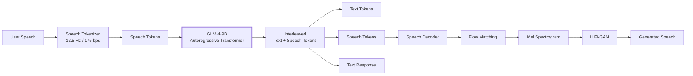

Conceptually:

**Speech waveform → discrete speech tokens → GLM → text + speech tokens → speech decoder → waveform**

The important point is that the GLM model itself predicts the discrete speech tokens. It is not simply an ASR → text LLM → independent TTS pipeline.

---

# 3. Speech Tokenizer

## Why a tokenizer is needed

Raw audio is continuous and contains far too many samples to directly feed into an autoregressive LLM.

GLM-4-Voice therefore converts speech into a compact sequence of discrete tokens.

### Target properties

The paper identifies three desirable properties:

1. **Low sampling rate + single codebook**
   - Makes autoregressive speech generation practical.
2. **Alignment with text**
   - Allows knowledge from a pretrained text LLM to transfer into speech.
3. **High-quality reconstruction**
   - Speech should still sound natural after tokenization and decoding.

---

## Tokenizer Architecture

The tokenizer is derived from **Whisper-large-v3**.

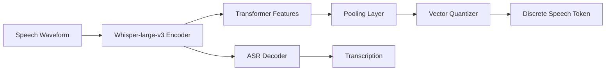

The model inserts a **pooling layer + vector quantization layer into the middle of the Whisper encoder**.

The resulting tokenizer selected for GLM-4-Voice operates at:

| Property | GLM-4-Voice |
|---|---:|
| Frame rate | **12.5 Hz** |
| Bitrate | **175 bps** |
| Codebooks | **1** |
| Base encoder | Whisper-large-v3 |
| Token type | Discrete speech token |

So approximately:

**12.5 speech tokens = 1 second of audio**

This extremely low token rate is important because autoregressive LLMs must generate one token after another.

---

# 4. Why Single-Codebook Matters

Many neural audio codecs use multiple residual vector-quantization (RVQ) codebooks.

That creates multiple audio tokens for one time position.

GLM-4-Voice instead uses **one codebook**.

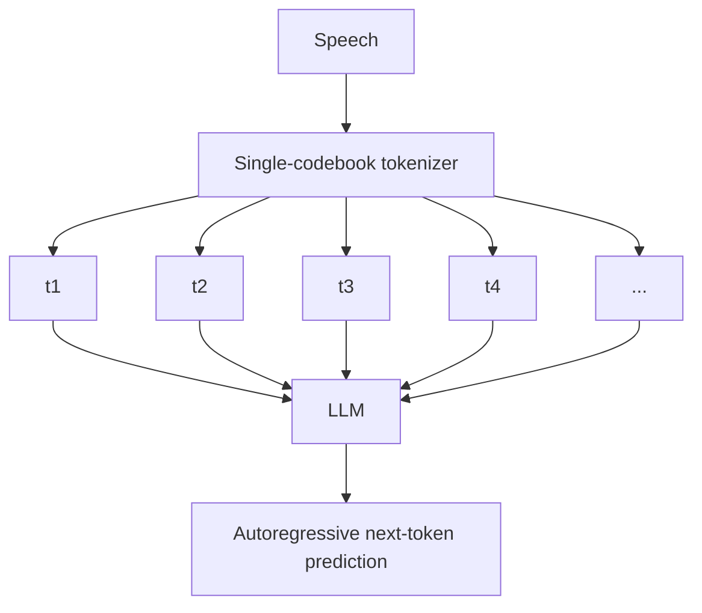

This lets the speech sequence behave much more like a normal language-model token sequence.

The tokenizer is only **175 bps**, which is dramatically smaller than typical high-fidelity acoustic token representations.

---

# 5. Streaming Speech Tokenizer

For real-time interaction, the tokenizer must work causally.

The paper modifies the Whisper encoder:

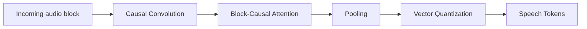

Changes include:

- The convolution before the Transformer is replaced with **causal convolution**.
- Bidirectional attention is replaced with **block-causal attention**.

Therefore, the tokenizer can process incoming speech incrementally instead of waiting for the entire utterance.

---

# 6. GLM Backbone

The language model starts from:

**GLM-4-9B-Base**

The vocabulary is expanded to include the discrete speech tokens.

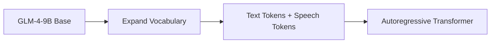

The architecture itself receives **minimal modifications**.

The same Transformer can therefore model:

- text → text
- speech → text
- speech → speech
- text/speech interleaved sequences

The key idea is to make speech another token modality that the autoregressive Transformer can predict.

---

# 7. Unified Speech Representation

GLM-4-Voice uses the **same speech representation for input and output**.

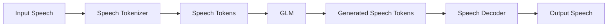

This allows the model to perform next-token prediction directly over speech sequences.

It also makes **unsupervised speech pretraining** possible because the model can learn from speech without every sample needing a text annotation.

---

# 8. Speech Decoder

The speech decoder converts generated discrete speech tokens back into waveform.

It is based on the **CosyVoice-style architecture**.

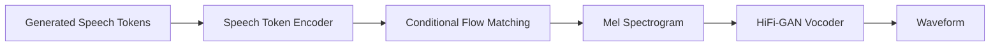

Components:

### 8.1 Speech Token Encoder
Converts the discrete speech-token sequence into conditioning representations.

### 8.2 Conditional Flow Matching
Generates a Mel spectrogram conditioned on the speech tokens.

### 8.3 HiFi-GAN
Converts the generated Mel spectrogram into the final speech waveform.

The decoder is trained to support **streaming inference**.

---

# 9. Streaming Speech Decoder

The decoder uses truncated audio chunks during training.

Let:

- `b` = block size
- `n` = current block

At inference, the decoder:

1. Receives speech tokens for the first `n × b` seconds.
2. Uses the previous `(n−1) × b` seconds as the prompt.
3. Predicts the next block.

For GLM-4-Voice:

**b = 0.8 seconds**

The paper reports that at least **10 speech tokens** are needed for the first generated audio output.

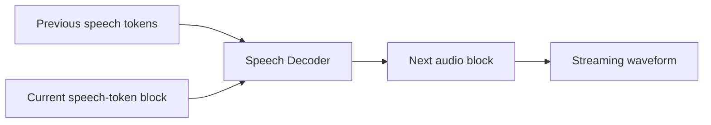

This enables incremental speech generation instead of waiting for the complete response.

---

# 10. The Important Part: Streaming Thoughts

This is the main technique used to reduce the latency caused by the model's need for textual reasoning/content planning.

The paper first defines speech-to-speech as two conceptual tasks:

### Task 1 — Speech-to-Text

```text
User speech Qs → Text answer At
```

### Task 2 — Speech-and-Text-to-Speech

```text
User speech Qs + Text answer At → Speech answer As
```

The textual answer helps guide speech generation.

However, generating **all of At first** causes a large delay.

---

# 11. Streaming Thoughts Solution

Instead of:

```text
Qs
 ↓
Generate complete At
 ↓
Generate complete As
 ↓
Play speech
```

GLM-4-Voice alternates between text and speech tokens:

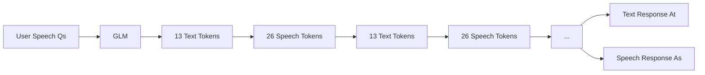

The selected ratio is:

**13 text tokens : 26 speech tokens = 1 : 2**

The reason is that text generation should remain faster than speech generation, so the speech tokens always have enough textual context.

---

# 12. Why "Streaming Thoughts" Is NOT Exactly CoT

This distinction is important.

The paper calls the mechanism **"Streaming Thoughts"**, but it is not a conventional Chain-of-Thought training method.

It means:

```text
Text generation → Speech generation → Text generation → Speech generation → ...
```

The text tokens provide semantic/content guidance for the speech tokens.

So:

**Streaming Thoughts ≠ explicit CoT reasoning**

It is primarily a **low-latency speech generation strategy**.

---

# 13. Training Pipeline

GLM-4-Voice has two major training stages.

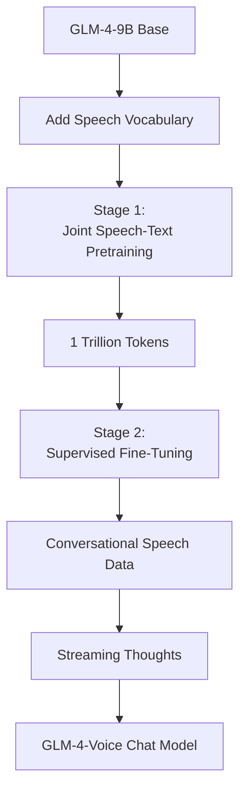

---

# 14. Stage 1 — Joint Speech-Text Pretraining

The goal is to transfer the capabilities of the text LLM into speech.

Three major speech-data categories are used.

### A. Interleaved Speech-Text Data

Existing text pretraining data is converted into speech-text interleaved sequences.

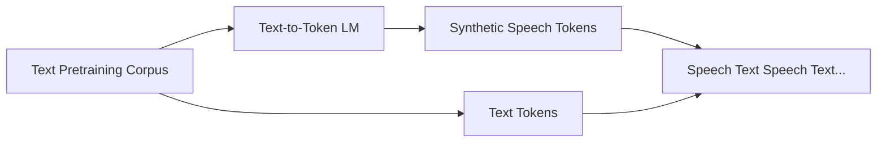

This solves an important problem:

**There is much more text data available than high-quality speech-text parallel data.**

Instead of requiring real paired speech for every example, existing text corpora are converted into synthetic speech-token sequences.

---

### B. Unsupervised Speech

The paper uses:

**700k hours of speech**

This teaches the model to perform speech language modeling directly from real-world speech.

---

### C. Supervised Speech-Text

Includes:

- ASR data
- TTS data

This provides explicit alignment between speech and text.

---

# 15. 1 Trillion Token Pretraining

The training corpus contains approximately:

| Data | Speech tokens | Text tokens |
|---|---:|---:|
| Speech-text | 455B | 279B |
| Speech-only | 31B | — |
| ASR + TTS | 11B | 3.5B |
| Text-only | — | 10T* |

The paper describes a **1 trillion-token training setup**, using:

- 30% text data
- one epoch of unsupervised speech
- one epoch of supervised speech-text
- remaining data from interleaved speech-text

\*The table reports 10T text tokens because the text-only corpus is sampled at a low epoch count.

Training uses:

- AdamW
- β1 = 0.9
- β2 = 0.95
- sequence length = 8192
- learning rate: `6e-5 → 6e-6`

---

# 16. Synthetic Interleaved Data — Key Idea

This is one of the most important techniques in the paper.

The problem:

```text
Huge text corpus
       +
Limited speech-text paired corpus
       ↓
Speech model cannot fully inherit LLM knowledge
```

Their solution:

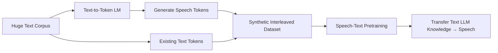

This allows speech data to be scaled using existing text data.

---

# 17. Stage 2 — Supervised Fine-Tuning

The second stage turns the pretrained speech-language model into a spoken chatbot.

Two major datasets are used.

### Multi-turn conversational spoken dialogues

Derived mainly from text conversations.

The data is filtered and modified to make responses appropriate for spoken interaction:

- Remove code/math-heavy content
- Shorten excessively long answers
- Remove content unsuitable for speech
- Synthesize corresponding speech
- Record diverse speech inputs

### Speech-style-controlled dialogues

These contain explicit speech-style requirements such as:

- speaking speed
- emotion
- dialect

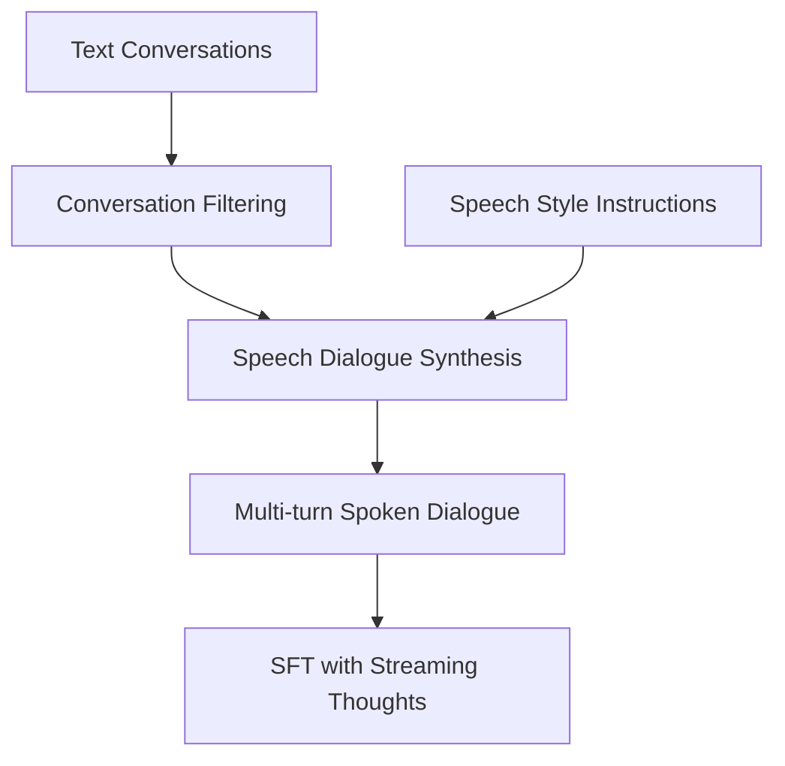

---

# 18. Different Learning Speeds for Text and Speech

The authors observe that the model learns:

**speech → text**

faster than:

**speech → speech**

So they split each training sample into two learning objectives.

### Objective A

Learn:

```text
Speech Input → Text Output
```

Speech-output loss is masked.

### Objective B

Learn:

```text
Speech Input + Text Output → Speech Output
```

Text-output loss is masked.

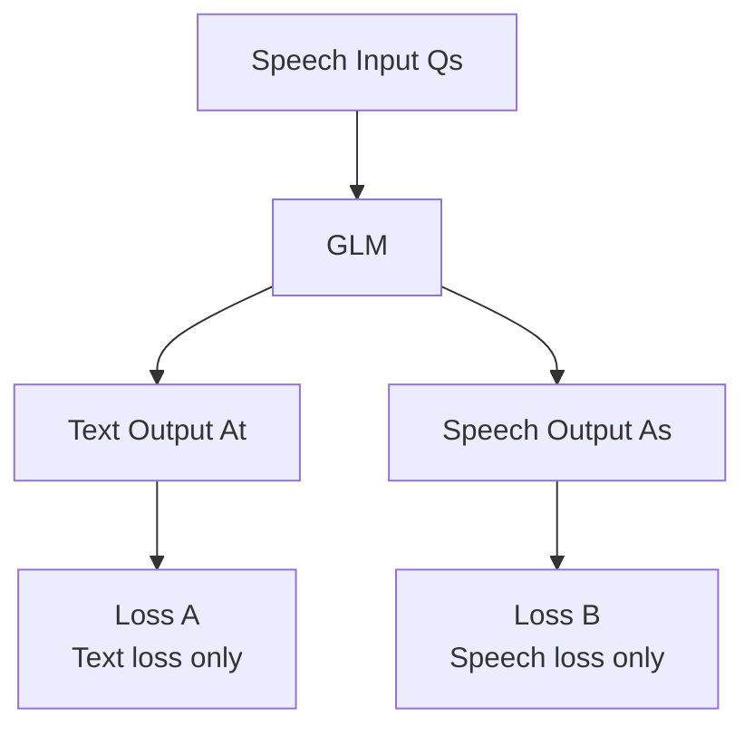

This separates the learning dynamics of semantic response generation and speech generation.

Training duration:

- **4 epochs** for text output
- **20 epochs** for speech output

Other SFT settings:

- Learning rate: `1e-5 → 1e-6`
- Weight decay: `0.1`
- Hidden-layer dropout: `0.5`
- Gradient clipping: `1.0`

---

# 19. Inference Pipeline

The actual inference process is:

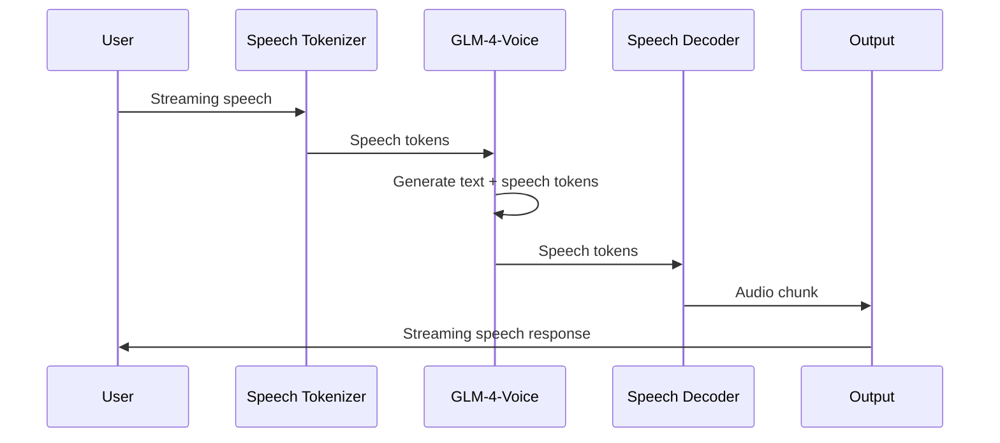

The tokenizer processes incoming speech continuously.

The LLM then performs autoregressive generation.

The speech decoder converts generated speech tokens into waveform chunks.

---

# 20. Latency Calculation

The paper decomposes first-response latency into four components:

\[
T_{total}
=
T_{speech\_tokenize}
+
T_{llm\_prefill}
+
T_{llm\_decode}
+
T_{speech\_decode}
\]

Where:

- `Tspeech_tokenize` = time to process the current incoming audio block
- `Tllm_prefill` = time to process the input speech tokens
- `Tllm_decode` = time to generate the initial text + speech tokens
- `Tspeech_decode` = time to turn the first speech tokens into waveform

For the first audio response, the model generates:

**13 text tokens + 10 speech tokens = 23 tokens**

and the speech decoder processes the first:

**10 speech tokens**

---

# 21. What Makes GLM-4-Voice Different?

### Traditional pipeline

```text
Speech
  ↓
ASR
  ↓
Text LLM
  ↓
TTS
  ↓
Speech
```

Problems:

- Separate models
- Cascaded latency
- ASR/TTS errors
- LLM controls mostly the content
- Difficult to preserve expressive speech characteristics

### GLM-4-Voice

```text
Speech
  ↓
Speech Tokens
  ↓
GLM-4-Voice
  ↓
Text + Speech Tokens
  ↓
Speech Decoder
  ↓
Speech
```

The Transformer directly predicts speech tokens, allowing the model to learn speech generation as part of the language-modeling process.

---

# 22. GLM-4-Voice vs Step-Audio 2

| Component | GLM-4-Voice | Step-Audio 2 |
|---|---|---|
| Core LLM | GLM-4-9B | Step-Audio LLM |
| Speech representation | 12.5 Hz single-codebook | Interleaved audio tokens |
| Speech bitrate | 175 bps | Uses CosyVoice 2 tokenizer |
| Speech input | Yes | Yes |
| Speech output | Yes | Yes |
| Text + speech generation | Yes | Yes |
| Streaming | Yes | Yes |
| Main latency technique | Streaming Thoughts | Streaming / interleaved generation |
| CoT reasoning | **Not a main component** | **Reasoning-centric SFT + RL** |
| RL | **Not used as a core method** | PPO + GRPO |
| RAG | **Not described** | Yes |
| Web search | **Not described** | Yes |
| Audio search | **Not described** | Yes |
| Training scale | 1T tokens | Much larger multi-stage speech/text training |
| Speech decoder | Flow Matching + HiFi-GAN | Flow Matching + HiFi-GAN |

The important conceptual progression is:

**GLM-4-Voice → speech-text unified autoregressive modeling + streaming**

**Step-Audio 2 → unified audio modeling + reasoning/RL + RAG/tools + richer audio interaction**

---

# 23. What to Remember for Implementation

If you want to reproduce the architecture conceptually, the core stack is:

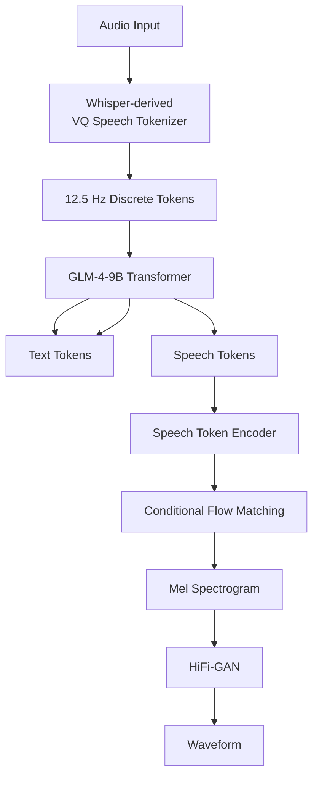

### Trainable/learned components

1. **Speech tokenizer**
   - Whisper encoder + pooling + vector quantization
2. **GLM-4-9B**
   - Extended vocabulary containing speech tokens
3. **Speech decoder**
   - Speech token encoder
   - Flow matching
   - HiFi-GAN
4. **SFT**
   - Conversational speech
   - Streaming Thoughts

---

# 24. One-Line Architecture

```text
Speech
→ Whisper-derived 12.5Hz VQ tokenizer
→ discrete speech tokens
→ GLM-4-9B autoregressive Transformer
→ interleaved text + speech tokens
→ Flow Matching + HiFi-GAN
→ streaming waveform
```

## Key takeaway

**GLM-4-Voice is fundamentally a pretrained text LLM extended into a speech-token language model.**

Its strongest architectural idea is not a separate reasoning module. It is the combination of:

**low-rate single-codebook speech tokens + large-scale synthetic speech-text pretraining + autoregressive text/speech modeling + Streaming Thoughts + streaming speech decoding.**

Source: uploaded GLM-4-Voice paper, especially the architecture and training sections on pages 3–8.
