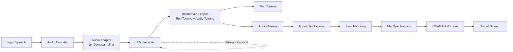
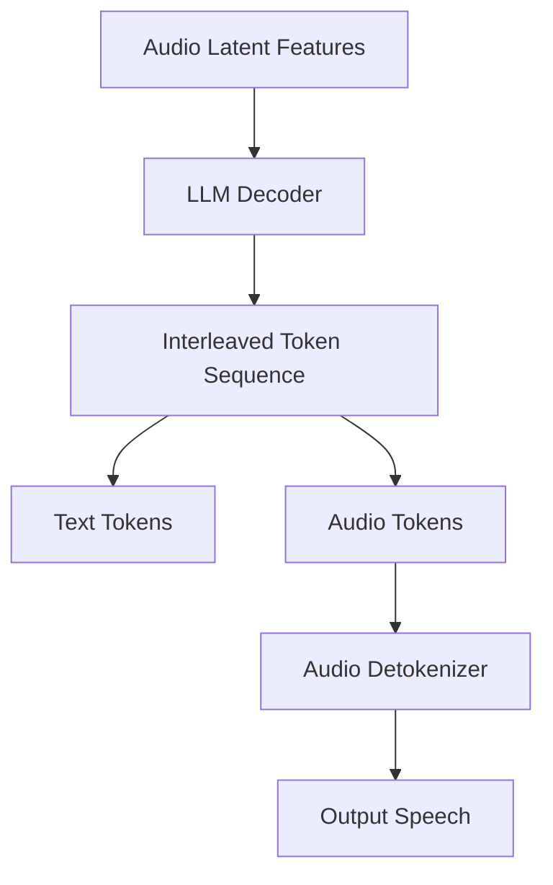
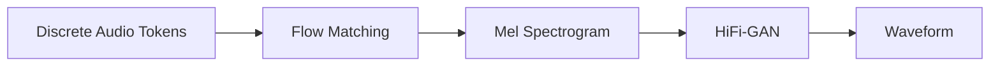
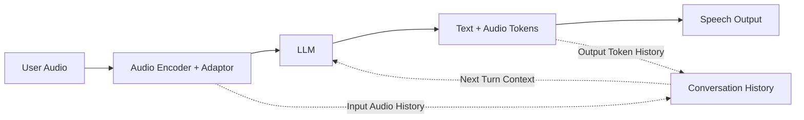
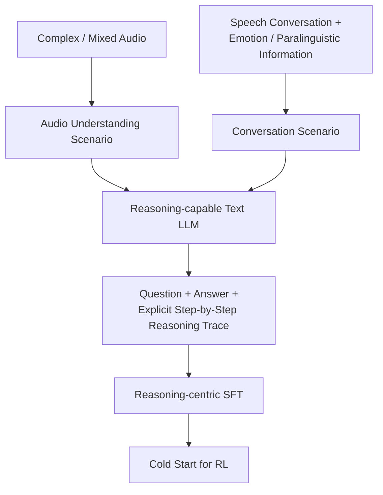
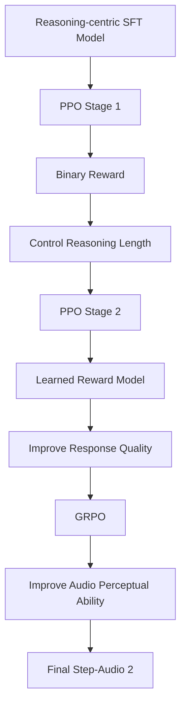
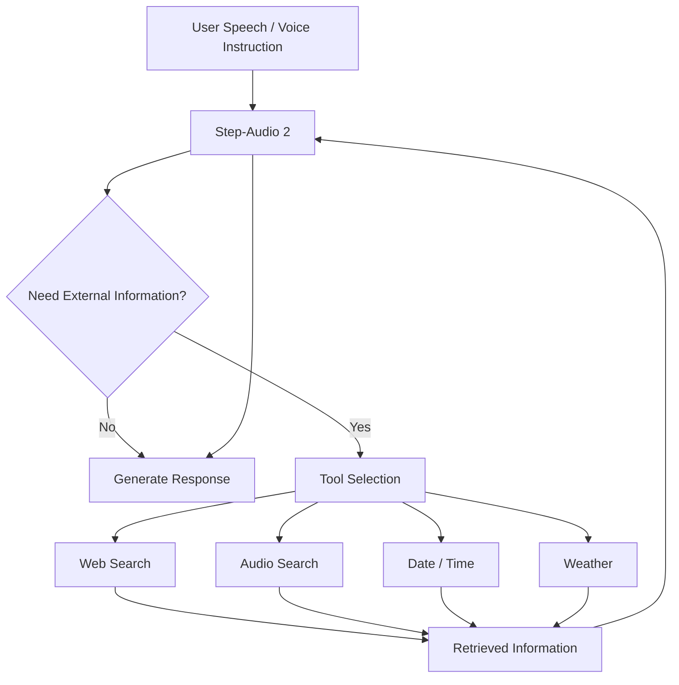
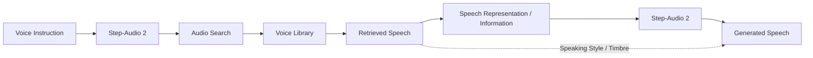
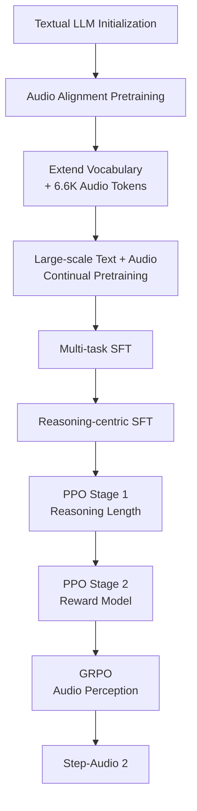

# Step-Audio 2 — Unified Audio LLM Architecture

> **Source:** *Step-Audio 2 Technical Report*, StepFun Audio Team (2025)  
> This document summarizes the architecture, reasoning/CoT, RL, RAG, and audio-search design described in the paper.

---

## 1. Core Idea

Step-Audio 2 is an **end-to-end Large Audio Language Model (LALM)**.

Unlike a cascaded:

```text
Speech → ASR → Text LLM → TTS → Speech
```

pipeline, Step-Audio 2 directly processes **audio representations** and makes the LLM generate **both text and discrete audio tokens**.

This allows the model to preserve and use **paralinguistic information** such as speaking style and emotion.

---

## 2. Overall Architecture



### Components

| Component | Function |
|---|---|
| **Audio Encoder** | Converts input speech/audio into latent acoustic features |
| **Audio Adaptor** | Connects the audio encoder to the LLM and downsamples the features |
| **LLM Decoder** | Performs language modeling and generates text + audio tokens |
| **Audio Detokenizer** | Converts generated audio tokens into waveform |
| **Flow Matching** | Generates Mel spectrogram from audio tokens |
| **HiFi-GAN** | Converts Mel spectrogram into waveform |

The paper states that the architecture consists of **audio encoder, audio adaptor, LLM decoder, and audio detokenizer**.

---

## 3. Audio Encoder → LLM

The audio encoder is pretrained on speech/audio understanding tasks including:

- ASR
- Speaker age/gender prediction
- Audio event detection

It produces features at **25 Hz** and remains frozen during training.

The audio adaptor uses a **2× downsampling rate**, reducing the feature frame rate:

```text
25 Hz
  │
  │ Audio Adaptor
  │ 2× downsampling
  ▼
12.5 Hz
```

The resulting latent audio features are directly consumed by the LLM.

### Important distinction

The LLM does **not** need to receive an intermediate ASR transcript as the representation of the input speech.

Instead:

```text
Speech
  ↓
Audio Encoder
  ↓
Latent Audio Features
  ↓
Audio Adaptor
  ↓
LLM
```

---

## 4. Unified Text + Audio Token Generation

A major architectural change is that the textual LLM's tokenizer is extended with **6.6K audio tokens**.

The LLM generates an **interleaved sequence** of text and audio tokens at a fixed ratio.

Conceptually:

```text
LLM Output

┌──────────┬───────────┬──────────┬───────────┬──────────┐
│ Text     │ Audio     │ Text     │ Audio     │ Text ... │
│ Token    │ Token     │ Token    │ Token     │          │
└──────────┴───────────┴──────────┴───────────┴──────────┘
```

The audio tokens are then extracted from the sequence and passed to the audio detokenizer.



This makes speech generation part of **language modeling itself**, rather than attaching an independent TTS system after the LLM.

---

# 5. Audio Detokenizer

The audio detokenizer converts the generated discrete audio tokens into an actual waveform.



### Flow Matching

The Flow-Matching module generates a Mel spectrogram from the output audio tokens.

The paper describes a CNN-based encoder layer inserted after each self-attention module within the Transformer block.

It was trained on approximately **200,000 hours of high-quality speech**.

The goal is improved:

- Pronunciation accuracy
- Timbre similarity
- Mel-spectrogram reconstruction

### Vocoder

**HiFi-GAN** converts the generated Mel spectrogram into the final waveform.

---

# 6. Multi-Turn Conversation

Step-Audio 2 also stores previous conversational information.

The paper states that:

- Input audio features
- Output interleaved text/audio sequences

are pre-filled as history information for the next conversation round.



---

# 7. CoT / Reasoning

Step-Audio 2 introduces **reasoning-centric datasets** to improve reasoning over complex audio.

The process is:



### Dataset construction

The paper describes two reasoning-centric datasets:

#### A. Complex acoustic reasoning

Multiple AudioSet and AudioCaps audio segments are combined to create more complicated acoustic environments.

#### B. Paralinguistic reasoning

Speech conversations are synthesized from dialogue scripts containing appropriate emotion descriptions.

A reasoning-capable textual LLM then generates:

```text
Question
   +
Answer
   +
Step-by-step reasoning trace
```

These datasets are used during SFT to **cold-start the subsequent RL stage**.

---

# 8. Reinforcement Learning

The paper uses a **multi-stage RL strategy**.



## PPO Stage 1 — Reasoning Length

A binary reward is used:

```text
Reward = 1
→ Reasoning is concise and appropriate

Reward = 0
→ Reasoning is empty or excessively long
```

The objective is to prevent the reasoning process from becoming too long for **real-time audio interaction**.

The paper reports:

- 60 iterations
- Global batch size: 64
- Actor LR: `1 × 10⁻⁶`
- Critic LR: `2.5 × 10⁻⁶`

## PPO Stage 2 — Response Quality

The binary reward is replaced by a **learned preference/reward model**.

The reward model evaluates response quality.

Reported setup:

- 120 iterations
- Batch size: 64
- Same learning-rate settings

## GRPO

Finally, **GRPO** is used for another 400 iterations to further improve audio perceptual capabilities.

---

# 9. RAG + External Tools

Step-Audio 2 is not restricted to knowledge contained in its parameters.

It can use external tools for:

```text
Audio Search
Date / Time
Weather
Web Search
```

The general interaction is:



The retrieved information is incorporated into the generation process.

---

# 10. Audio Search — Key Unique Feature

The most distinctive tool is **Audio Search**.

The paper describes a voice library containing **hundreds of thousands of speeches**, together with their:

- Transcriptions
- Descriptions

The model can retrieve a suitable speech and use it to influence speech generation.



This enables:

- **Timbre switching**
- **Speaking-style imitation**

The retrieved information is appended **after the input audio features** before speech generation.

---

# 11. Training Pipeline

The complete training procedure can be summarized as:



### Pretraining numbers

The paper reports approximately:

- **1.356T tokens** of text/audio continual pretraining
- Initial **100B ASR tokens** for audio-text alignment
- **6.6K audio tokens** added to the textual tokenizer
- Additional large-scale text/audio training
- Final high-quality cooldown stage

---

# 12. Why This Architecture Is "Unified"

### Cascaded architecture

```text
Speech
  ↓
ASR
  ↓
Text
  ↓
LLM
  ↓
Text
  ↓
TTS
  ↓
Speech
```

Problems:

- Multiple model boundaries
- Latency from sequential modules
- Information can be lost during speech → text conversion
- Paralinguistic information is harder to preserve

### Step-Audio 2

```text
              ┌──────────────────────┐
Speech ──────►│ Audio Encoder        │
              └──────────┬───────────┘
                         ↓
                  Latent Features
                         ↓
              ┌──────────────────────┐
              │      LLM Decoder     │
              │                      │
              │ Reasoning            │
              │ Text Modeling        │
              │ Audio Modeling       │
              │ Tool Use             │
              └──────────┬───────────┘
                         ↓
                  Audio Tokens
                         ↓
              ┌──────────────────────┐
              │ Audio Detokenizer    │
              └──────────┬───────────┘
                         ↓
                      Speech
```

The central idea is therefore:

> **Audio is brought into the LLM as latent features, while speech output is represented as discrete audio tokens generated directly by the LLM.**

CoT/RL improve reasoning over complex audio; RAG and tools provide external knowledge; Audio Search additionally provides acoustic/style information.

---

## 13. Implementation Summary

| Layer | Step-Audio 2 implementation |
|---|---|
| Input | Raw speech/audio |
| Audio representation | Frozen pretrained audio encoder |
| Audio frame rate | 25 Hz → 12.5 Hz through adaptor |
| Alignment | Train adaptor using ASR data |
| LLM | Textual LLM continually pretrained with audio |
| Audio vocabulary | +6.6K discrete audio tokens |
| Output representation | Interleaved text + audio tokens |
| Audio tokenizer | CosyVoice 2 tokenizer |
| Audio generation | Flow Matching |
| Waveform synthesis | HiFi-GAN |
| Reasoning | Reasoning-centric SFT + CoT traces |
| RL | PPO → PPO → GRPO |
| Knowledge grounding | RAG |
| External tools | Web, audio, date/time, weather |
| Voice control | Audio Search → timbre/style conditioning |
| Conversation | Audio/token history pre-filled into next turn |

---

## 14. One-Line Architecture

```text
Raw Audio
→ Frozen Audio Encoder
→ Audio Adaptor
→ Unified LLM
→ Interleaved Text + Audio Tokens
→ Audio Detokenizer
→ Flow Matching
→ HiFi-GAN
→ Speech
```

With reasoning and external knowledge:

```text
Audio
  ↓
Audio Encoder + Adaptor
  ↓
LLM ───────► CoT / Reasoning
 │
 ├─────────► RAG / Web Search
 │
 ├─────────► Audio Search
 │
 └─────────► Date / Weather
  ↓
Text + Audio Tokens
  ↓
Speech
```

**Core architectural contribution:** the LLM itself becomes the central multimodal autoregressive model that understands audio, reasons over it, uses tools, and generates discrete speech representations, rather than relying on an `ASR → LLM → TTS` cascade.
