# Step-Audio — Technical Architecture & Implementation Notes

> **Paper:** Step-Audio: Unified Understanding and Generation in Intelligent Speech Interaction  
> **arXiv:** 2502.11946v2  
> **Date:** 18 Feb 2025  
> **Team:** Step-Audio Team, StepFun

---

## 1. Core Idea

Step-Audio is a **130B-parameter speech-text multimodal model** designed for real-time intelligent speech interaction.

Its main design goal is to unify:

- speech understanding
- text understanding
- speech generation
- voice cloning
- emotion/style control
- dialect control
- tool calling
- role-playing

The important architectural point is slightly different from a pure speech-to-speech model:

> **The 130B model performs audio understanding and generates text/audio tokens, while the production real-time voice system uses an external TTS-style speech decoder for waveform generation.**

The authors call the real-time dialogue architecture **AQTA (Audio Question → Text Answer) + TTS**.

---

# 2. Overall Architecture

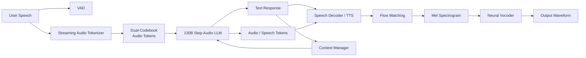

The paper's Figure 2 shows the three main model components:

1. **Speech Tokenizer**
2. **130B LLM**
3. **Speech Decoder**

The tokenizer converts speech into discrete tokens, the LLM models text and speech tokens, and the decoder produces the waveform.

---

# 3. Why Step-Audio Uses AQTA + TTS

A completely pure speech-to-speech training setup requires large amounts of high-quality conversational speech data.

The paper identifies this as a major bottleneck.

Therefore, instead of forcing every training example to be:

```text
Speech → Speech
```

Step-Audio primarily uses:

```text
Audio → Text
```

for the LLM's conversational reasoning/understanding, followed by:

```text
Text / Audio Tokens → TTS → Waveform
```

This provides better training efficiency and gives explicit control over output characteristics such as:

- timbre
- pitch
- emotion
- dialect
- speaking style

The paper explicitly states that the final real-time voice architecture is **AQTA + TTS**.

---

# 4. Three Main Components

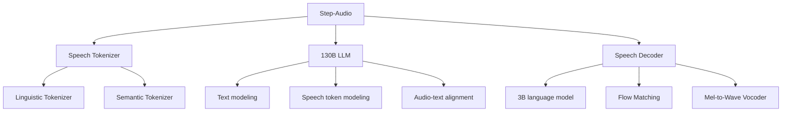

---

# 5. Dual-Codebook Speech Tokenizer

This is one of the most important contributions.

Instead of using one audio representation, Step-Audio uses **two parallel tokenizers**:

### 1. Linguistic tokenizer

Captures:

- phonemic information
- linguistic structure
- high-level speech information

It uses the output of the **Paraformer encoder**.

Parameters:

- **16.7 Hz**
- **1024-codebook**

### 2. Semantic tokenizer

Captures:

- semantic information
- coarse acoustic characteristics
- information useful for natural speech generation

It uses the **CosyVoice tokenizer**.

Parameters:

- **25 Hz**
- **4096-codebook**

The paper reports that the dual-codebook representation improves both semantic coherence and reconstructed audio quality.

---

# 6. Why Two Codebooks?

The authors explicitly compare single-codebook and dual-codebook training.

### Semantic-only

```text
Good semantic coherence
        +
Low next-token perplexity
        -
Poor acoustic reconstruction
        ↓
Poor timbre / prosody
```

### Linguistic-only

```text
Good reconstructed audio
        +
Better auditory quality
        -
High next-token perplexity
        -
Poor semantic coherence
```

### Dual-codebook

```text
Semantic tokens
      +
Linguistic tokens
      ↓
Better semantic coherence
      +
Better pronunciation / auditory quality
      ↓
Better unified speech modeling
```

The paper reports that dual-codebook training lowers the next-token prediction perplexity for both token types and improves ASR performance.

---

# 7. Temporal Interleaving

The two tokenizers have different frame rates:

```text
Linguistic = 16.7 Hz
Semantic   = 25 Hz
```

Their ratio is approximately:

\[
16.7 : 25 \approx 2 : 3
\]

Therefore Step-Audio interleaves:

```text
L L S S S | L L S S S | L L S S S | ...
```

where:

- `L` = linguistic token
- `S` = semantic token

So every:

**2 linguistic tokens + 3 semantic tokens**

form one aligned group.

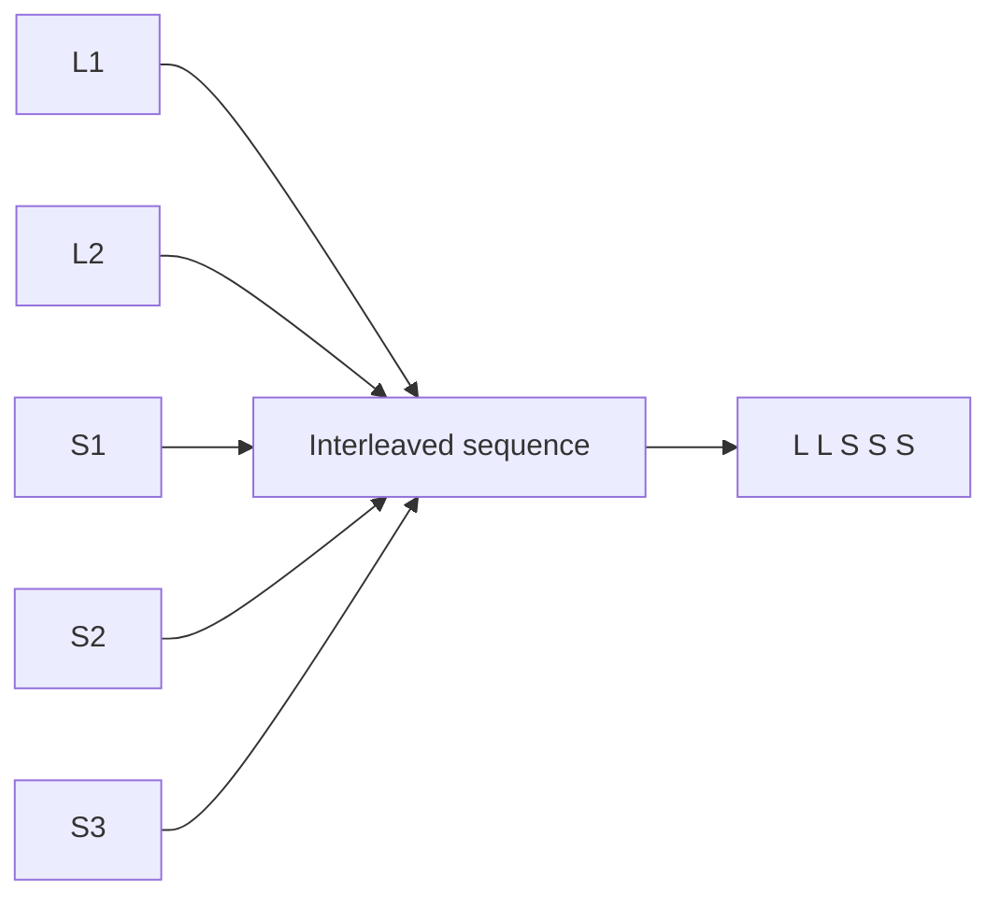

This gives the LLM a unified discrete representation while preserving the complementary information of both tokenizers.

---

# 8. 130B LLM

The core language model is based on **Step-1**, a pretrained **130B-parameter text LLM**.

The model is extended with audio-token vocabulary and trained using audio-contextualized continual pretraining.

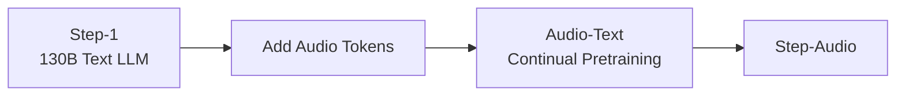

The model can process:

- text tokens
- linguistic audio tokens
- semantic audio tokens

and model their relationships through autoregressive language modeling.

---

# 9. Multi-Turn Context

A major problem is token length.

Audio contains far more tokens than its text transcription.

The paper therefore uses **text transcription for historical conversation context**.

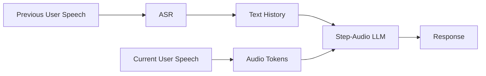

The model still has the capability to use raw audio tokens as history when required.

For normal long conversations, however:

```text
Audio history → ASR → Text history
```

is much more compact.

The paper reports an average:

\[
\text{text tokens} : \text{audio tokens} \approx 1 : 14
\]

so text history substantially reduces context cost.

---

# 10. Speech Decoder

The speech decoder is a separate **3B-parameter model**.

It contains:

1. Speech decoder language model
2. Flow-matching model
3. Mel-to-wave vocoder

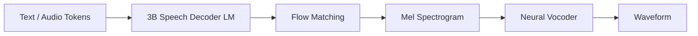

The decoder is trained using the same dual-codebook interleaving scheme so that linguistic and semantic information remain aligned during speech generation.

---

# 11. Flow Matching + Vocoder

The speech decoder generates continuous audio in two stages:

```text
Discrete tokens
      ↓
Flow Matching
      ↓
Mel Spectrogram
      ↓
Neural Vocoder
      ↓
Waveform
```

The paper describes this as a hybrid speech synthesizer optimized for real-time waveform generation.

---

# 12. Real-Time Inference Pipeline

This is a major engineering contribution.

The system contains:

- VAD
- Streaming Audio Tokenizer
- Step-Audio LLM
- Speech Decoder
- Controller
- Context Manager

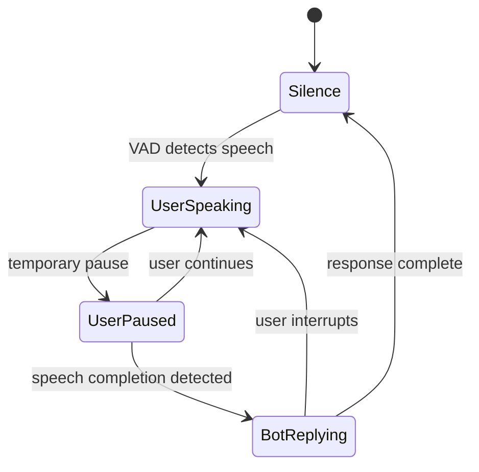

---

# 13. Streaming Audio Tokenizer

The input audio stream is processed continuously.

There are **two parallel tokenizer pipelines**:

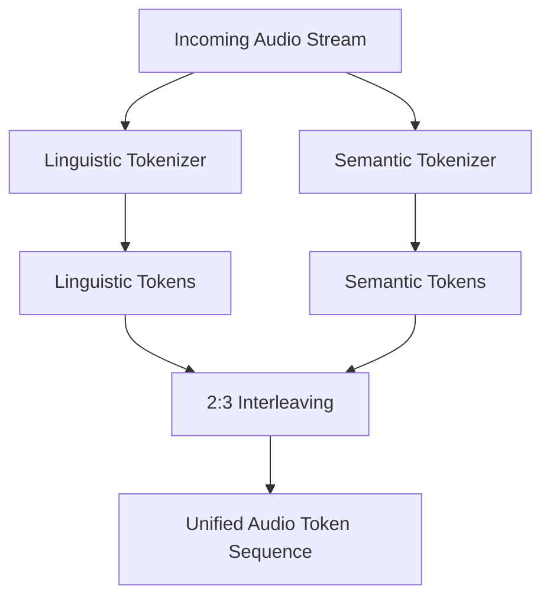

Both pipelines use fixed-duration segmentation.

Their outputs are merged using the:

**2:3 linguistic:semantic interleaving ratio.**

This avoids waiting for the entire input utterance before tokenization.

---

# 14. Speculative Response Generation

Step-Audio introduces speculative response generation to reduce perceived latency.

The idea is:

```text
User starts speaking
       ↓
User pauses briefly
       ↓
System assumes the user may be finishing
       ↓
Generate a speculative response
       ↓
If user continues → discard it
If user finishes → commit it
```

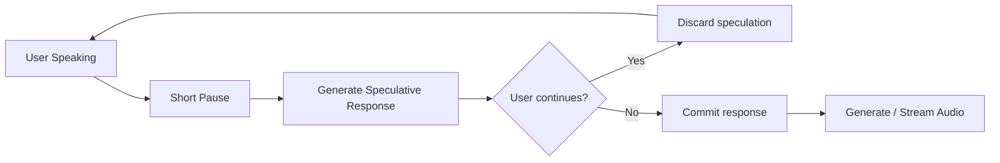

The paper reports:

- approximately **40%** of speculative responses are successfully committed
- approximately **500 ms** reduction in per-response latency

This is a system-level latency optimization rather than a change to the core Transformer architecture.

---

# 15. Controller

The Controller coordinates the real-time pipeline.

It manages:

- state transitions
- speculative response generation
- interaction between VAD and tokenizer
- response commitment
- interruptions

Main components:

```text
VAD
 │
 ▼
Controller
 ├── Streaming Audio Tokenizer
 ├── Step-Audio LLM
 ├── Speech Decoder
 └── Context Manager
```

---

# 16. Context Manager

The Context Manager maintains conversational continuity.

Instead of keeping all historical speech tokens:

```text
Speech₁ → Speech₂ → Speech₃ → ...
```

the system asynchronously converts previous user speech to text:

```text
Speech₁ → ASR → Text₁
Speech₂ → ASR → Text₂
Speech₃ → ASR → Text₃
```

Then the LLM receives compact textual history.

The current/latest speech can still be processed as audio tokens.

---

# 17. Pretraining Dataset

Step-Audio is part of the larger **Step-Omni** training setup.

The pretraining dataset contains:

### Audio

| Data | Tokens | Approx. hours |
|---|---:|---:|
| Audio continuation | 1.1T | 7.3M |
| TTS synthesized speech | 113B | 700K |
| ASR | 105B | 650K |
| Audio-text alternating | 350B | 2M |

### Text

**800B tokens**

Includes:

- web documents
- books
- code
- proprietary material

### Image

**800B tokens**

Includes image-text paired/alternating data.

---

# 18. Three-Stage Pretraining

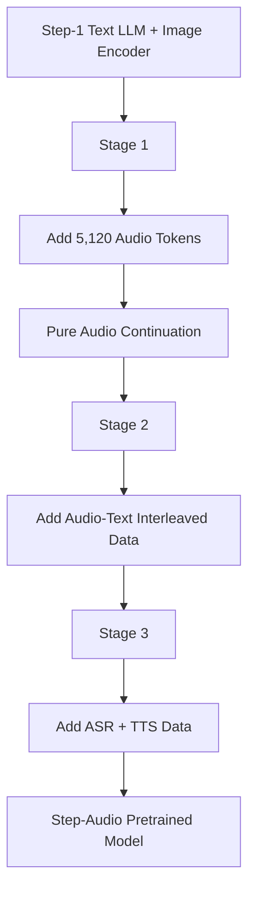

## Stage 1

- Add **5,120 audio tokens**
- Add pretrained image encoder
- Image encoder frozen
- Audio/text/image ratio = **2:1:1**
- Audio task = pure audio continuation
- Text backbone learning rate = `2e-5`
- Embedding and LM head learning rates = `5×` backbone

Purpose:

> Teach the pretrained text model to operate over the new audio-token vocabulary while preserving its original capabilities.

---

## Stage 2

After approximately **1.2T tokens**:

- introduce audio-text interleaved data
- audio continuation : audio-text interleaved = **1:1**
- overall audio:text:image ratio remains **2:1:1**

Purpose:

> Improve alignment between speech and text representations.

---

## Stage 3

After approximately **800B tokens** in Stage 2:

Add:

- ASR
- TTS

Data ratio:

```text
Audio continuation : Audio-text interleaved : ASR : TTS
          1         :          1           : 1 : 1
```

Overall:

```text
Audio : Text : Image = 4 : 3 : 3
```

The embedding and LM-head learning rates are synchronized with the backbone and use cosine decay from:

\[
2\times10^{-5} \rightarrow 5\times10^{-6}
\]

---

# 19. Why Dual-Codebook Training Works

The paper's ablation on page 10 shows lower training loss for the dual-codebook model than the corresponding single-codebook setup.

Conceptually:

```text
Linguistic tokens
      ↕
Semantic tokens
      ↓
Mutual information exchange
      ↓
Better next-token prediction
      ↓
Better speech understanding
      +
Better speech reconstruction
```

The authors also report improved ASR CER:

```text
Single-codebook: 25.5
Dual-codebook:   18.4
```

on the reported 3B-model ASR experiment with the same amount of audio training data.

---

# 20. Synthetic TTS Data Engine

A major contribution beyond the base architecture is the **generative speech data engine**.

The problem:

```text
Need millions of hours of:
- languages
- dialects
- speakers
- emotions
- styles
- singing/RAP
```

Manually recording all of this is extremely expensive.

Step-Audio instead generates training data.

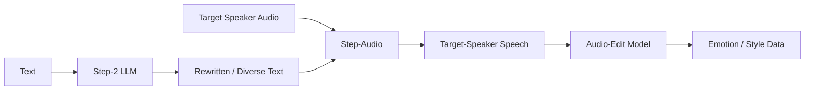

---

# 21. Language and Dialect Generation

For a target language/dialect:

1. Step-2 rewrites/translates the text.
2. Native-speaker audio + text is collected as a seed.
3. Step-Audio performs audio continuation.
4. New target-speaker speech is generated.

```text
Small amount of native seed data
             ↓
Step-2 rewriting
             ↓
Step-Audio continuation
             ↓
Large synthetic language/dialect dataset
```

This is particularly useful for:

- Cantonese
- Sichuan dialect
- Japanese
- Korean
- other target languages/styles

---

# 22. Emotion and Speaking Style

The paper introduces an **Audio-Edit Model**.

Training process:

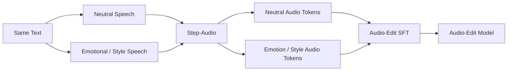

This enables controlled transformations such as:

```text
Neutral → Happy
Neutral → Angry
Neutral → Sad
Normal speed → Fast
Normal speed → Slow
```

The comparative tags support **five hierarchical levels** for emotion and speed.

---

# 23. Singing and RAP

The paper also builds a singing/RAP dataset.

Pipeline:

```text
10,000+ hours singing/RAP
          ↓
Demucs vocal separation
          ↓
VAD
          ↓
LyRiCs timestamp segmentation
          ↓
Lyrics ↔ vocal alignment
          ↓
Quality filtering
          ↓
Training dataset
```

The model learns to map lyrics to:

- linguistic tokens
- semantic tokens

and the speech decoder reconstructs high-fidelity vocals.

---

# 24. Post-Training for TTS

The TTS model uses:

- system prompt
- human input
- assistant response

The response contains the dual-codebook representations.

Instruction tags control:

### Descriptive attributes

- language
- dialect
- vocal characteristics
- style

### Comparative attributes

- emotion
- speaking speed

The TTS model used here is **3B parameters**.

Training:

- 1 epoch
- initial LR = `2 × 10⁻⁵`
- cosine decay
- lower bound = `2 × 10⁻⁶`

---

# 25. AQTA SFT

For the conversational model, the paper defines several data formats.

### TQTA

```text
Text Question → Text Answer
```

### AQTA

```text
Audio Question → Text Answer
```

This is central to the voice-chat architecture.

### TAQTA

```text
Text Question → Text Answer
                 +
Speech consistency
```

The text question is used as input but does not contribute to loss, while the corresponding text output does.

### AQAA

```text
Audio Question → Audio Answer
```

Other multimodal formats are also used.

---

# 26. Why AQTA Is Important

The model can understand:

```text
Speech → semantic representation → textual response
```

Then the TTS system turns the response into controlled speech.

This avoids requiring massive amounts of pure:

```text
Speech → Speech
```

conversation data.

Therefore:

```text
Large text/ASR/TTS resources
          ↓
Unified 130B speech-text model
          ↓
Strong audio understanding
          ↓
TTS-controlled speech generation
```

---

# 27. RLHF / PPO

Step-Audio **does use reinforcement learning** for the AQTA conversational model.

The final **Step-Audio-Chat** model is produced using RLHF.

Pipeline:

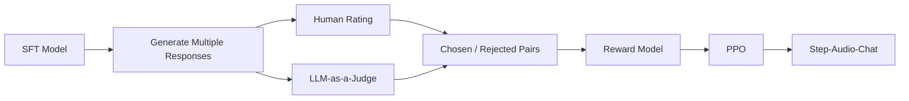

---

# 28. Reward Model

Human annotators score responses from **1–5** based on:

- instruction following
- conversational naturalness
- safety

For objective questions, an LLM judge evaluates correctness.

The reward model is trained in two stages:

1. TQTA preference-model pretraining
2. AQTA cross-modal fine-tuning

It uses **Bradley-Terry loss**.

Reported pairwise accuracy on the human preference test set:

**70.51%**

---

# 29. PPO

After training the reward model:

```text
SFT model
   ↓
Reward model
   ↓
PPO
   ↓
Step-Audio-Chat
```

Reported PPO settings:

- PPO clip ε = **0.2**
- initial learning rate = **1e-6**
- minimum LR = **2e-7**
- KL penalty β = **0.05**
- critic warm-up = **80 steps**

---

# 30. "Deaf Hacking" Problem

The paper identifies an RLHF failure mode called **deaf hacking**.

The reward model could give high reward to responses such as:

```text
"I didn't hear clearly."
```

even when the user's audio was actually clear.

Why?

The preference dataset contained a pattern where:

```text
unclear audio → "I didn't hear clearly" → chosen
clear audio   → not enough corresponding rejected examples
```

The reward model therefore learned a shortcut.

They mitigate this by adding hacked-PPO-generated responses as rejected examples.

The authors also mention rule-based rewards as future work.

---

# 31. Asynchronous Tool Calling

Step-Audio supports **real-time tool calls**.

The key idea is to decouple:

```text
Text processing / tool calling
```

from:

```text
Audio generation
```

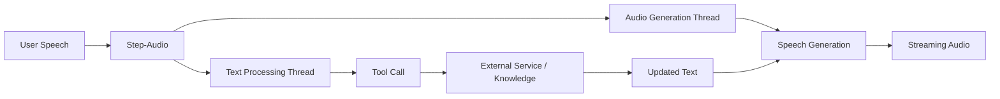

This allows the system to:

- invoke external services
- retrieve information
- continue speech generation

in parallel.

The paper specifically highlights knowledge retrieval as an example.

---

# 32. Role-Playing and Voice Control

The model is trained for instruction-driven speech control.

Examples include:

```text
Language
Dialect
Emotion
Speaking speed
Voice style
Singing
RAP
Role-playing
```

The goal is not merely:

```text
"say this sentence"
```

but:

```text
"say this sentence in Cantonese,
with an emotional style,
at a particular speaking rate"
```

---

# 33. Is There CoT?

**CoT is not described as a core architectural component of Step-Audio in this paper.**

The paper focuses on:

- audio-token modeling
- multimodal continual pretraining
- AQTA
- TTS
- synthetic data generation
- instruction control
- RLHF/PPO
- speculative inference
- tool calling

So for your unified-audio-LLM comparison:

```text
GLM-4-Voice
    → Streaming Thoughts

Step-Audio
    → AQTA + TTS
    → RLHF/PPO
    → Tool Calling
    → Synthetic Speech Data

Step-Audio 2
    → Reasoning-centric SFT
    → PPO + GRPO
    → RAG / Web Search / Audio Search
```

Do **not** label Step-Audio's RLHF as CoT reasoning.

---

# 34. Step-Audio vs GLM-4-Voice vs Step-Audio 2

| Feature | GLM-4-Voice | Step-Audio | Step-Audio 2 |
|---|---|---|---|
| Core approach | Unified speech-token LM | Unified speech-text model + TTS | End-to-end multimodal audio LLM |
| Main LLM | GLM-4-9B | Step-1 130B | Step-Audio 2 LLM |
| Audio tokenizer | Single codebook | **Dual codebook** | Audio tokenizer |
| Linguistic tokens | No | **16.7 Hz / 1024** | — |
| Semantic tokens | Single speech representation | **25 Hz / 4096** | — |
| Text + speech modeling | Yes | Yes | Yes |
| Speech decoder | Flow Matching + HiFi-GAN | **3B LM + Flow Matching + vocoder** | Flow Matching + HiFi-GAN |
| Streaming | Yes | **Yes** | Yes |
| Speculative generation | Limited/Streaming Thoughts | **Yes** | Yes |
| RL | Not core | **RLHF + PPO** | **PPO + GRPO** |
| CoT | Not conventional CoT | **Not core** | Reasoning-centric training |
| Tool calling | Not core | **Yes** | Yes |
| RAG | No | Knowledge/tool retrieval | **Yes** |
| Audio search | No | No | **Yes** |
| Voice control | Yes | **Strong** | Strong |
| Model scale | 9B | **130B** | Larger unified system |

---

# 35. Core Architecture to Remember

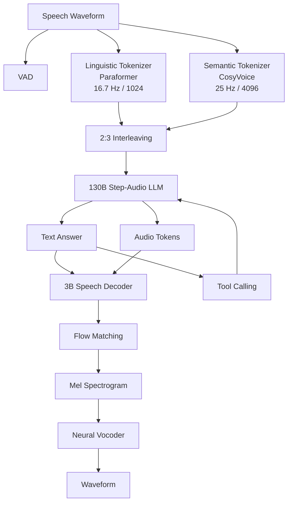

---

# 36. One-Line Architecture

```text
Speech
→ VAD + dual-codebook tokenizers
→ 2:3 linguistic/semantic interleaving
→ 130B Step-1-based multimodal LLM
→ Text + audio-token modeling
→ 3B speech decoder
→ Flow Matching
→ Neural Vocoder
→ Real-time speech
```

---

# 37. Most Important Technical Contributions

### 1. Dual-codebook speech representation

Separates:

```text
Linguistic information
+
Semantic/acoustic information
```

and interleaves them at **2:3**.

### 2. 130B audio-contextualized LLM

Extends a strong text LLM into a multimodal speech model through continual pretraining.

### 3. Synthetic speech data engine

Uses Step-Audio itself, Step-2, and an Audio-Edit model to generate large-scale:

- speaker
- language
- dialect
- emotion
- style
- singing/RAP

data.

### 4. Real-time speculative inference

Uses VAD + streaming tokenization + speculative response generation.

### 5. RLHF/PPO for speech dialogue

Optimizes the final AQTA voice-chat model using human and LLM preference signals.

### 6. Asynchronous tool calling

Separates tool retrieval from audio generation so external knowledge can be obtained without blocking speech synthesis.

---

## Final Concept

Step-Audio sits between a traditional cascaded voice system and a fully speech-native autoregressive model:

```text
Traditional:
ASR → LLM → TTS

        ↓

Step-Audio:
Speech → Dual Audio Tokens → 130B LLM → Text/Audio → TTS

        ↓

Step-Audio 2:
Speech → Audio LLM → Reasoning/RL → Tools/RAG → Audio
```

The most important idea in Step-Audio is therefore **not CoT**. It is the combination of **dual-codebook audio representation + large-scale audio-contextualized LLM pretraining + controllable TTS + RLHF + real-time speculative/tool-enabled inference**.
